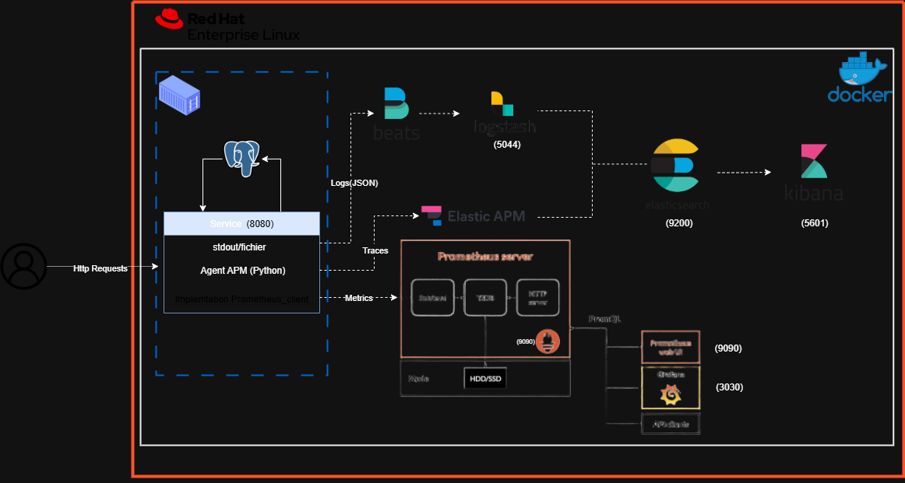

# Bank App Supervision - Observabilité Applicative et Infrastructure

## 📋 Contexte du Projet

Ce projet a été réalisé dans le cadre d'un **stage PFA (Projet de Fin d'Année) 2024-2025**, effectué entre **juillet et août 2024** (2 mois) au sein de la **Banque Populaire**, dans le **Centre Service**, département **Supervision des Flux, Services et Plateformes**.

**Auteur :** [Votre Nom et Prénom]

---

## 🎯 Objectifs du Projet

Ce projet vise à mettre en place une solution complète d'**observabilité applicative et infrastructure** pour une application bancaire, avec les objectifs suivants :

- **Observabilité applicative** : Traçabilité complète des transactions, logs structurés, et monitoring des performances
- **Observabilité infrastructure** : Surveillance des ressources système (CPU, mémoire, stockage, réseau)
- **Pipeline de données** : Conception et mise en place d'un pipeline de traitement des logs pour la centralisation et l'analyse
- **Sécurisation** : Protection des métriques et des transactions sensibles
- **Anticipation des pannes** : Mise en place de métriques et alertes pour détecter et prévenir les pannes majeures

---

## 🏗️ Architecture du Projet



*Note : Veuillez ajouter l'image d'architecture dans le dossier `docs/` avec le nom `architecture.png`*

### Composants Principaux

#### **Application Bancaire**
- **Flask** : Application web bancaire avec gestion des comptes et transactions
- **PostgreSQL** : Base de données relationnelle pour les données bancaires
- **Gunicorn** : Serveur WSGI pour la production

#### **Observabilité Applicative (ELK Stack + APM)**
- **Elasticsearch** : Moteur de recherche et stockage des logs
- **Kibana** : Interface de visualisation et d'analyse des logs
- **Logstash** : Pipeline de traitement et transformation des logs
- **Filebeat** : Collecte des logs depuis les fichiers et conteneurs Docker
- **Elastic APM** : Monitoring des performances applicatives et traçage des transactions

#### **Observabilité Infrastructure (Prometheus + Grafana)**
- **Prometheus** : Collecte et stockage des métriques
- **Grafana** : Dashboards de visualisation des métriques
- **Node Exporter** : Exportation des métriques système (CPU, mémoire, disque, réseau)
- **Metricbeat** : Collecte des métriques système et Docker
- **Packetbeat** : Analyse du trafic réseau

---

## 🔄 Pipeline de Données

### Pipeline de Logs

Le pipeline de traitement des logs suit le flux suivant :

```
Application Flask → Logs JSON structurés
    ↓
Filebeat (collecte)
    ↓
Logstash (transformation et enrichissement)
    ↓
Elasticsearch (indexation)
    ↓
Kibana (visualisation et analyse)
```

**Caractéristiques du pipeline :**
- **Logs structurés** : Format JSON pour faciliter l'analyse
- **Enrichissement** : Ajout de métadonnées (host, Docker, timestamps)
- **Filtrage** : Sélection uniquement des logs de l'application bancaire
- **Indexation temporelle** : Création d'index par jour (`app-logs-YYYY.MM.dd`)

### Pipeline de Métriques

```
Node Exporter / Metricbeat → Métriques système
    ↓
Prometheus (scraping et stockage)
    ↓
Grafana (visualisation via dashboards)
```

**Métriques collectées :**
- **Infrastructure** : CPU, mémoire, disque, réseau, processus
- **Application** : Nombre de requêtes HTTP, latence, codes de statut
- **Docker** : Métriques des conteneurs (CPU, mémoire, I/O)
- **Réseau** : Analyse du trafic réseau via Packetbeat

---

## 🔐 Sécurisation des Métriques et Transactions

### Sécurité des Métriques
- **Authentification Elasticsearch** : Utilisation de mots de passe sécurisés via variables d'environnement
- **Isolation réseau** : Services isolés dans un réseau Docker dédié (`banknet`)
- **Chiffrement** : Support TLS/SSL pour les communications (configurable en production)
- **Accès restreint** : Limitation des accès aux interfaces de monitoring

### Sécurité des Transactions
- **Traçabilité complète** : Toutes les transactions sont tracées via Elastic APM
- **Logs sécurisés** : Les données sensibles sont filtrées dans les logs
- **Authentification** : Système d'authentification Flask-Login avec hachage bcrypt
- **Validation** : Validation stricte des montants et des comptes avant traitement

---

## 📊 Métriques pour l'Anticipation des Pannes

### Métriques Infrastructure
- **CPU** : Utilisation processeur pour détecter les surcharges
- **Mémoire** : Consommation RAM pour prévenir les OOM (Out Of Memory)
- **Stockage** : Espace disque disponible pour éviter les saturations
- **Réseau** : Bande passante et erreurs réseau
- **Processus** : Top processus consommateurs de ressources

### Métriques Applicatives
- **Taux d'erreur** : Pourcentage de requêtes en erreur
- **Latence** : Temps de réponse des endpoints critiques
- **Throughput** : Nombre de requêtes par seconde
- **Transactions** : Volume et types de transactions bancaires

### Alertes Recommandées
- CPU > 80% pendant 5 minutes
- Mémoire > 90%
- Espace disque < 10%
- Taux d'erreur > 5%
- Latence P95 > 1 seconde

---

## 🚀 Installation et Déploiement

### Prérequis

- **Système d'exploitation** : Red Hat Linux (ou compatible)
- **Docker** : Version 20.10 ou supérieure
- **Docker Compose** : Version 2.0 ou supérieure
- **Mémoire** : Minimum 6 Go RAM recommandé
- **Ports disponibles** : 8080, 5432, 9200, 5601, 5044, 8200, 9090, 3030, 9100

### Configuration Initiale

1. **Configurer `vm.max_map_count` pour Elasticsearch** :
```bash
cd bank-app-supervision
bash scripts/post-install.sh
```

2. **Créer le fichier `.env`** :
```bash
# Consulter ENV_VARIABLES.md pour la liste complète des variables
# Créer un fichier .env avec toutes les variables nécessaires
# Modifier les mots de passe et configurations selon vos besoins
```

### Démarrage

```bash
# Démarrer tous les services
make up

# Vérifier le statut des conteneurs
make ps

# Attendre que tous les services soient "healthy"
docker compose ps
```

### Initialisation des Données

```bash
# Créer des données de démonstration
make seed
```

---

## 🌐 Accès aux Interfaces

| Service | URL | Identifiants |
|---------|-----|--------------|
| **Application Bancaire** | http://localhost:8080 | `admin@demo.local` / `admin123`<br>`user@demo.local` / `user12345` |
| **Kibana** | http://localhost:5601 | `elastic` / (valeur de `ELASTIC_PASSWORD` dans `.env`) |
| **Elasticsearch** | http://localhost:9200 | `elastic` / (valeur de `ELASTIC_PASSWORD` dans `.env`) |
| **APM (via Kibana)** | Kibana → APM | - |
| **Prometheus** | http://localhost:9090 | - |
| **Grafana** | http://localhost:3030 | `admin` / `admin` (à changer au premier login) |

---

## 📝 Commandes Utiles

```bash
make up            # Démarrer tous les services
make down          # Arrêter tous les services
make logs          # Afficher les logs de tous les services
make ps            # Afficher le statut des conteneurs
make seed          # Initialiser des données de démonstration
make test          # Exécuter les tests unitaires
make clean         # Nettoyer tous les volumes et données
```

---

## 📁 Structure du Projet

```
bank-app-supervision/
├── app/                    # Application Flask
│   ├── app/
│   │   ├── routes/        # Routes de l'application
│   │   ├── models.py      # Modèles de données
│   │   └── services.py    # Services métier
│   ├── Dockerfile
│   └── requirements.txt
├── prometheus/            # Configuration Prometheus
│   └── prometheus.yml
├── grafana/               # Configuration Grafana
│   └── provisioning/
├── filebeat/              # Configuration Filebeat
│   └── filebeat.yml
├── logstash/              # Pipeline Logstash
│   └── pipeline/
│       └── logstash.conf
├── metricbeat/            # Configuration Metricbeat
│   └── metricbeat.yml
├── packetbeat/            # Configuration Packetbeat
│   └── packetbeat.yml
├── apm-server/            # Configuration APM Server
│   └── apm-server.yml
├── sql/                   # Scripts SQL d'initialisation
│   └── init/
├── scripts/               # Scripts utilitaires
├── logs/                  # Logs de l'application
├── volumes/               # Volumes Docker (données persistantes)
├── docker-compose.yml     # Orchestration Docker
├── Makefile              # Commandes simplifiées
└── README.md             # Ce fichier
```

---

## 🔧 Technologies Utilisées

### Backend
- **Python 3.x** : Langage de programmation
- **Flask 2.3.3** : Framework web
- **SQLAlchemy 2.0.31** : ORM
- **PostgreSQL 15.6** : Base de données
- **Gunicorn** : Serveur WSGI

### Observabilité
- **Elasticsearch 8.14.3** : Moteur de recherche
- **Kibana 8.14.3** : Visualisation
- **Logstash 8.14.3** : Traitement des logs
- **Filebeat 8.14.3** : Collecte de logs
- **Metricbeat 8.14.3** : Collecte de métriques système
- **Packetbeat 8.14.3** : Analyse réseau
- **Elastic APM 8.14.3** : Application Performance Monitoring
- **Prometheus v2.52.0** : Collecte de métriques
- **Grafana 10.4.2** : Dashboards
- **Node Exporter v1.8.1** : Métriques système

### Infrastructure
- **Docker** : Conteneurisation
- **Docker Compose** : Orchestration

---

## 🛠️ Dépannage

### Problèmes Courants

**Elasticsearch ne démarre pas**
- Vérifier que `vm.max_map_count` est configuré (exécuter `scripts/post-install.sh`)
- Augmenter la RAM allouée si nécessaire
- Vérifier les logs : `docker compose logs elasticsearch`

**Ports déjà utilisés**
- Arrêter les services concurrents
- Modifier les mappings de ports dans `docker-compose.yml`

**Filebeat permissions**
- Filebeat utilise `--strict.perms=false` pour éviter les problèmes de permissions

**Packetbeat nécessite des capacités réseau**
- Les capacités `NET_RAW` et `NET_ADMIN` sont déjà configurées dans `docker-compose.yml`

---

## 🔒 Sécurité en Production

⚠️ **Ce setup est pédagogique et destiné au développement/test.**

Avant un déploiement en production, il est **fortement recommandé** de :

1. **Changer tous les mots de passe** par défaut
2. **Activer TLS/SSL** pour toutes les communications
3. **Créer des rôles dédiés** pour Beats, APM et Logstash dans Elasticsearch
4. **Configurer des règles de pare-feu** pour limiter l'accès
5. **Mettre en place des sauvegardes** régulières
6. **Activer l'audit logging** pour Elasticsearch
7. **Configurer des alertes** dans Grafana et Kibana
8. **Chiffrer les données sensibles** au repos

---

## 📖 Guides Supplémentaires

Ce projet inclut des guides supplémentaires pour vous aider :

- **[ENV_VARIABLES.md](ENV_VARIABLES.md)** : Liste complète des variables d'environnement nécessaires
- **[GITHUB_SETUP.md](GITHUB_SETUP.md)** : Guide étape par étape pour pousser le projet sur GitHub

---

## 📚 Ressources et Documentation

- [Documentation Elastic Stack](https://www.elastic.co/guide/index.html)
- [Documentation Prometheus](https://prometheus.io/docs/)
- [Documentation Grafana](https://grafana.com/docs/)
- [Documentation Flask](https://flask.palletsprojects.com/)
- [Documentation Docker](https://docs.docker.com/)

---

## 📄 Licence

Ce projet a été réalisé dans le cadre d'un stage académique. Tous droits réservés.

---

## 👤 Contact

Pour toute question ou suggestion concernant ce projet, veuillez contacter l'auteur.

---

**Dernière mise à jour :** Août 2024
